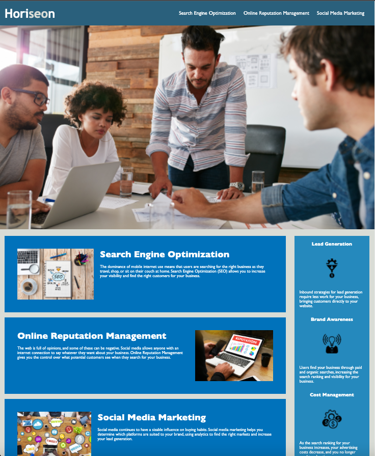

# Horiseon

Horiseon is a marketing agency that wanted to their website to be in compliance with accessibility standards, and further expand their SEO capabilities.

## Objectives

1. Relabeled the semantic tags within the html
2. Reorganized the CSS file to follow a logical structure
3. Created alt attributes for each image
4. Edited the footer to have headings in sequential order
5. Edited the title to be more descriptive

[Click me to access deploy link](https://saukchung.github.io/horiseon-site-refactor/)

